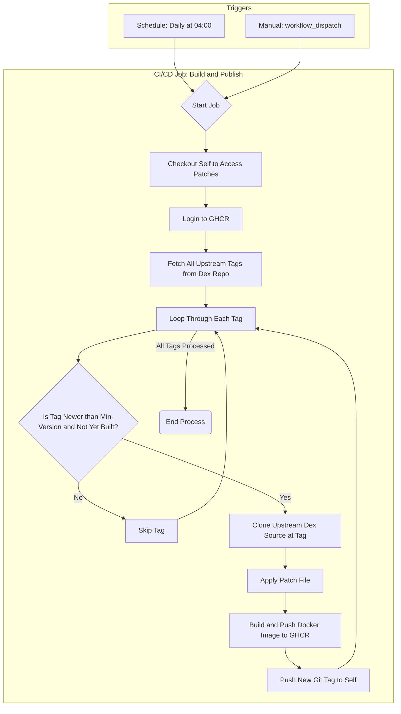

# Patched Dex with OAuth Domain Filter

This repository contains a patch for the [Dex](https://github.com/dexidp/dex) Identity Provider. It automatically builds and publishes Docker images of Dex with the applied patch for each new upstream release.

## What The Patch Does

The patch introduces a new configuration option, `allowedDomains`, to the generic **OAuth 2.0 connector**.

This feature allows you to restrict user logins to only those whose email addresses belong to a specified list of domains.

When the `allowedDomains` list is configured, the connector will:
1. Verify that the user's identity claims include an email address.
2. Extract the domain from the email address.
3. Check if the domain is present in the `allowedDomains` list.

If the user's email domain is not in the list, or if the user has no email claim, their login attempt will be rejected.

### Example Configuration

Here is an example of how to use the new option in your Dex configuration file:

```yaml
connectors:
- type: oauth
  id: my-oauth-provider
  name: My OAuth Provider
  config:
    # ... other OAuth configuration (clientID, clientSecret, etc.)
    
    # Restrict login to users with emails from 'example.com' or 'company.org'
    allowedDomains:
    - example.com
    - company.org
```

## Automated Build Workflow

This repository uses a GitHub Actions workflow to monitor for new version tags from the official `dexidp/dex` repository. When a new tag is discovered, the workflow automatically performs the following steps:
1. Clones the source code for the new tag.
2. Applies the domain-filtering patch.
4. Build and pushes the image to GitHub Container Registry (GHCR).
5. Creates a corresponding Git tag in this repository to mark the version as built.

The resulting Docker images are available at `ghcr.io/Split174/dex-oauth-domain-filter`

### Workflow Diagram

The following diagram illustrates the CI/CD process:

